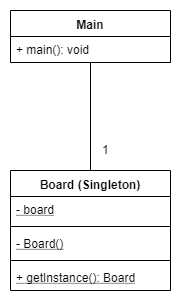
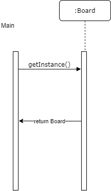
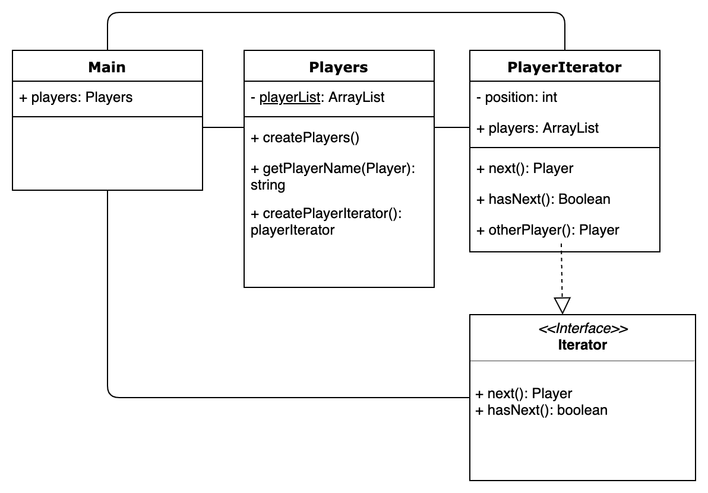
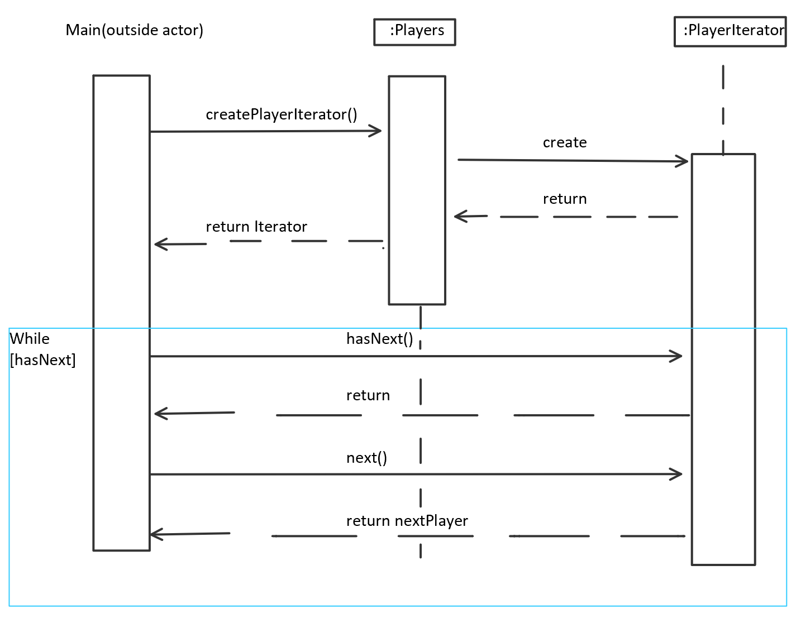
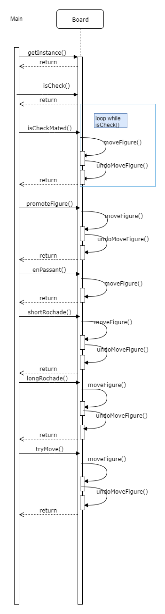

#Assignment 3
##Part 1

### Design pattern 1: Singleton

1. The Singleton design pattern ensures that there is only one instance of the class Board, 
   such that only one chessboard is created. 
   In the class Board the constructor is set to private and the method getInstance() is created
   to return one instance of Board. 
2. Class diagram:

3. Sequence diagram:

### Design pattern 2: Iterator
1. We are using the Iterator Design Pattern to iterate over the players array in the main, while providing encapsulation. The PlayerIterator implements the Iterator Interface, implementing the defined methods next() and hasNext(). 
Additionally, we implement the otherPlayer Method to switch players in the methods of the board.
2. Class diagram:

3. Sequence diagram:

##Part2
This is the simplified version of the Sequence diagram where all outgoing method calls from the board class are left away, if they don`t influence class attributes of the board directly:

This is the complete sequence Diagram. We left away the labeling return which should be on all dashed arrows which are from right to left.

##Part 3

### 3) Scoreboard using the Observer

#### Implementation Choices

We implemented an interface Observable with the methods registerObserver() which can be used to add an Observer to the Arraylist observers, 
unregisterObserver() that can delete an Observer from the observers-Arraylist and notifyOberservers() that notifys all oberservers.
This interface is implemented by Board. 
We used an interface with the name Observer, with the method void update(). 
This interface is implemented by the newly generated class Scoreboard, 
which keeps track of the score of each player.
The main function adds Scoreboard to the observers list of board by calling registerObserver().Every time a chess piece gets eaten the Scoreboard gets updated by using notifyObservers(). 
To do this we had to change our method removeFigure() in Board so that it calls notifyOberservers() when a figure gets eaten. 

##Game Description
#### Input Style

chosen figure - starting position - target position
e.g. P (Pawn) - a2 - a4 -> Pa2a4

**we do not consider shortcut moves like "e8" as valid**

there is not need to indicate if a figure has to be killed, e.g. "Pa2xa4"

##### Castling

small Rochade: O-O (letter O)
large Rochade: O-O-O

##### En Passant

write "ep" at the end of your move to indicate an en passant move, e.g. "P2a4ep"

##### Promotion

to promote a Pawn, write the requested figure token at the end of your input, e.g. "P7a8aQ" to request a Queen

