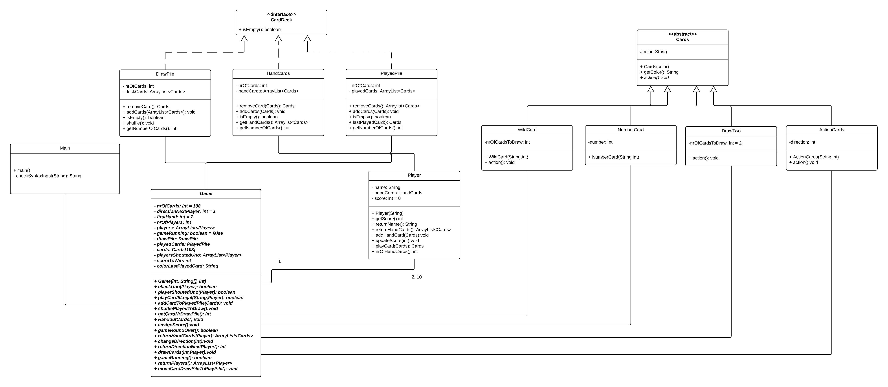

#Assignment 5

##Task1
###Bugs Found:

- When a Player moves to a field which is a Snake, which puts him back to his initial position, the player was set to the start field
because the end field of the snake was occupied (although by the player itself). This was corrected
in the *updatePosition* method of the Player class.

- One was able to input an empty String as Playername, this was corrected in the PlayerSetup Class. The bug was
found in the PlayerTest Class.

###Notes
Remind: we used threads to test the functions requireing a user input. thus it might take a while
for the tests to complete, escpecially the PlayerSetupTest.

##Task2
###GameBoardTest:
4 Tests failed: 

####markTwice

This test checks if a mark can be set at a given position. If the board at that position is empty
a new mark should be set and true should be returned. Otherwise (if board at that position is occupied)
false should be returned and we can't set a mark.

The method mark() in the class GameBoard should return true if a mark can be set at a given position and 
false otherwise.
Switched lines 71 and 74.
 
####markOnBoard 

This test checks if a mark could be set on the board. 

The test failed because marks couldn't be at the beginning. Fixing the test markTwice also
fixed this test. (Switched lines 71 and 74 in mark().)

####getOpenPositions

This test sets a mark at position 0,0 and adds all empty fields to a list. After that it checks if the
method getOpenPositions() returns the same list. 

The method getOpenPositions() should iterate through all columns but the for loop starts at col = 1 
and it therefore skips the first column (indexes of the columns are 0,1,2).
Changing col = 1 to col = 0 in line 99 fixes the code. 

####getOpenPositionsAll

This test adds all fields of the board into a list (there is no mark set). After that it checks if the 
method getOpenPositions() returns the same list. 

Same problem as in getOpenPositions. Changing col = 1 to col = 0 in line 99 in getOpenPositions()
fixed the code. 

###TicTacToeGameStateTest:
7 Tests failed:

###startingPlayerIsX  

This test checks if the starting player has the mark "X". 

When first calling the method getCurrentPlayer() it should return "X". Instead of just returning the
current player it also always set it to "O".
Deleting lines 82 and 83 fixed the problem.

###switchPlayer

This test checks if switching the player works. It failed because getCurrentPlayer() always returned
"O". 
Deleting lines 82 and 83 in getCurrentPlayer() fixed the problem.

###hasWinCol

This test checks if the marks in a column are the same so that the player can win. 

It failed because the method hasWin() returned "false" instead of "true" when a column was complete.
Changing "false" to "true" in line 103 fixed the code.

###hasWinRow

This test checks if the marks in a row are the same so that the player can win. 

It failed because the method hasWin() returned "false" instead of "true" when a row was complete.
Changing "false" to "true" in line 103 fixed the code.

###isOverWin

This test calls the isOver() method which calls the hasWin() method to check if either one of the 
players has won. 

Fixing the problem in hasWinCol or hasWinRow fixes also this one.

###hasWinDiagonal

This test checks if a player can win by setting marks in the diagonal. 

It failed because the method completesDiagonal() checks the wrong fields. After getting the mark 
from the center of the board it should check if the fields in the edges of the board have the same 
mark. But the method checked the field 1,2 (which is not in a diagonal) instead of the field 2,2.
Changing board.getMark(1,2) in line 158 to board.getMark(2,2) fixes the problem.

###getAvailableStatesLastOne

This test checks if there are no available fields after marking all of them. 

Fixing the problem in getOpenPositions() solves the problem.

##Task 3

###1 Identify how the system should behave: 

 The program should only accept input that are syntactically correct (syntactically not correct inputs should not be accepted by the program), the input must be of the following form:
 
 Inputs to set up game : 
 
 If the user gets asked for the number of players only inputs between 2 and 10 should be accepted. 
 The Score to win must be a integer number. 

 "Color" + "Card typ" e.g. Blue1 or BlackWild
 
 In case that a player plays his second last card he should add Uno to his input:
 
 "Color" + "Card typ" + "Uno" eg. RedSkipUno
 
 In case that the user can't play a card or don't want to play a card he can give the input "Draw"
  
 The accepted colors are : Green, Red, Blue, Yellow, Black 
 
 The accepted card types for all colors beside black are: 0,1,2,3,4,5,6,7,8,9, Draw2, Skip, Reverse.
 For the color black the accepted card types are: Wild and WildDraw4, for the WildCards the user has to add "chosenColor" at the end.
 E.g. BlackWildGreen. 
 
 If a player wants to catch somebody that didn't shout Uno he can give the input "Uno" + "Player name" (e.g. UnoMarc) of the player 
 that didn't shout uno. This must happen before the next player has taken his turn. 
 
 The syntactic check happens in the the main class in the function checkSyntaxInput() , as long as the user doesn't give a 
 syntactically correct input he gets asked again to give an input by displaying the output: "The given input is symentically not correct."
 
 If the user has given an syntactically correct input, the input string gets precessed by the game function 
 playCardIfLegal() for it's semantical correctness. 
 
 
 ##### Inputs that are only accepted during the game is running: 
 
 If one of the inputs in this section is given this things get checked and this actions performed:
 It gets checked if the game is running, for this the Game function
 gameRunning() gets called and if it returns true, the further checks of this section get performed.
 Else the Output "The game is not running" gets displayed, after that the user must give another input.
 
 If the input is a card that the user wants to play this things get checked and this actions performed:
 
 - Does the player have the (by the input) specified card in his hand. This is done in the playCardIfLegal() method
 of the board. If the specified card is in the ArrayList of HandCards the next check gets performed else
   the Output "Your don't have the card that you wanna play" gets displayed, after that the user
   must give another input. 
   
- Is it allowed to lay down this card according to the Unorules. For this the Game function
  playCardIfLegal(String) gets called which checks if playing the card is legal
  , if it is legal the card gets played and true gets returned. Else the function returns false
  and the Output "Your not allowed to play this card" gets displayed, after that the user
  must give another input. 
  
  
If the ending uno or the command Uno is given this things get checked and this actions performed:

  - It gets checked if the player has only one card by calling the Game function checkUNO() gets called to check
  if the player has only one card the same function is used to check if a player has forgot to say Uno.
  If the function returns falls an approproit output gets displayed.   
  
 If the input is draw this the Game function drawCards() is called, since drawing is sematically always legal. 
 
 
##### Inputs that are only accepted during the game is not running: 
 
 This are the inputs number of players, playernames or Score to win. If one of this inputs is given the it gets checked if the game is 
 not running by for this the Game function gameRunning() gets called and if it return is false the main saves the input, and asks the user for the 
 missing inputs to initalize the Game. Else the output "The game is running, command not allowed" gets displayed.
 
 If the inputs are semantically or syntactically not corrected the program display an appropriat error message and the actions
 of the input want get performed. If the input is correct the main functions performes the actions specified by the input by using
 functions of the game class. 
 
 At the beginning of the Game the following outputs get displayed:
 
 - "Enter number of players" 
 - "Enter playerX name"
 - "Enter score to win"
 Before every turn the command: "playername it is your turn, specified the card that you want to play" gets displayed. 
 Further his hand cards get displayed in the format specified above. As soon as a player played all his card the message: "playername
 one this round gets displayed", if a player wins the whole game the output "playername wins the game" is displayed. 
 
 All the above listed Outputs are expected aswell as appropriat error messages. Any internal outputs that are not necessary for the user
 shouldn't be displayed. It shouldn't happen that the user doesn't receive any kind output
 (errormessage or new command what he has to do) at all. 
 
  
###2 Class Diagram of the Uno Game

  
  

 
 
 
 
 
 
 
